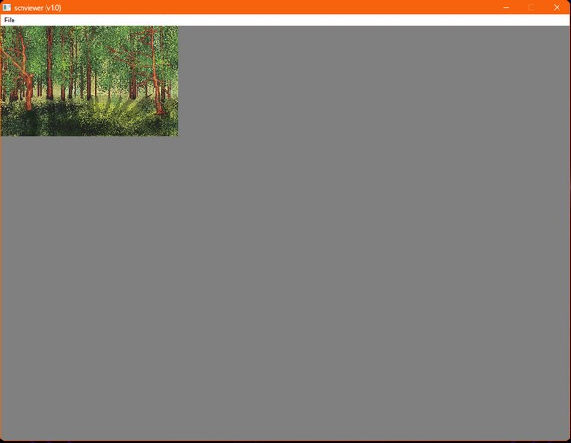
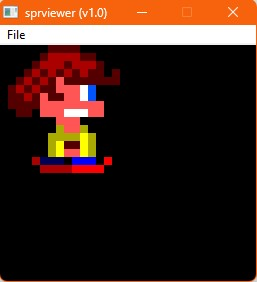

# Agon Light sprite edition suite

This is a suite of tools to create sprites and screens for the Agon Light computers.

1) spredit let you draw animated sprites directly in your AgonLight or Agon Console 8. These sprites can be 4x4, 8x8, 16x16 or 32x32 pixels.
2) png2scn is a windows tool to convert png images with the right size and number of colors to a screen format.
3) png2spr is a windows tool to convert png animstrip to animated sprites, compatible with spredit.
4) scnviewer is a windows tool that let you view your converted screens.
5) sprviewer is a windows tool that let you view your converted sprites.
6) zap is an algorythm to crunch/decrunch your images.
7) in palettes folder, you can find AgonLight default palette for Aseprite, Pro Motion or a png with the palette.

DjPoke
